# de101-data-pipeline


## 📖 Project Overview

`de101-data-pipeline` is a **production-oriented data engineering project** designed to build and manage
multiple batch ETL pipelines across different data domains using a **scalable, modular architecture**.

The repository focuses on demonstrating production-oriented data engineering
practices, including workflow orchestration, data quality validation,
analytical data modeling, and containerized deployment.

The project is structured as a multi-pipeline platform where each data domain
is implemented as an independent Airflow DAG with reusable pipeline components.
---

Key focus areas:

- **Workflow orchestration** with Apache Airflow  
- **Data quality validation** using Great Expectations  
- **Analytical modeling and transformation** via DBT, DuckDB, and Apache Spark  
- **Containerized deployment** for local and cloud-ready environments using  

Each data domain is implemented as an **independent Airflow DAG**, while reusable pipeline logic lives in `src/`, promoting **testability, maintainability, and scalability**.

---

## 🎯 Key Objectives
- ✅ Maintain modular and reusable DAGs
- ✅ Ensure data quality and validation throughout the pipeline
- ✅ Enable scalable batch and cloud-ready ETL
- ✅ Support easy local development and testing
- ✅ Promote clear separation of concerns between orchestration, transformation, and storage
---

## 📂 Repository Structure

```
de101-data-pipeline/
├── airflow
│   ├── dags/           # Airflow DAG definitions organized by data domain
│   │   ├── lol_champ_perf/  # DAGs for League of Legends champion performance pipelines
│   │   └── other_domain/    # DAGs for other data domains
│   ├── .env             # Environment variables for Airflow
│   ├── Dockerfile       # Dockerfile for Airflow container
│   ├── docker-compose.yml # Docker Compose setup for local Airflow deployment
├── dbt/                 # dbt project for transformations and modeling
├── helm/
│   ├── airflow/         # Helm charts for deploying Airflow on Kubernetes
│   ├── spark/           # Helm charts for deploying Spark cluster on Kubernetes
├── spark-cluster/       # Spark cluster setup for local development / testing
│   ├── docker-compose.yml # Docker Compose setup for local Spark cluster
├── src/                 # Reusable pipeline logic (extract, validate, load, transform)
│   ├── common
│   │   └── config.py    # Project-wide configuration constants
│   │   └── file_handler.py # Utilities for file I/O (parquet, csv, etc.)
│   │   └── logger.py    # Logging utilities
│   ├── lol_champ_perf   # Domain-specific pipeline logic for LoL champion performance
├── tests/               # Unit and integration tests for DAGs and pipeline modules
├── requirements.txt     # Python dependencies for the project

```

> Each DAG is kept **thin**, delegating all execution logic to `src/` for **reusability and maintainability**.

---

## 🔄 Typical Pipeline Flow

```mermaid
flowchart LR
    A[Airflow DAG Triggered] --> B[Bronze Layer: Raw JSON / Parquet]
    B --> C[Data Validation: Great Expectations]
    C --> D[Silver Layer: Cleaned & Merged Tables]
    D --> E["Transformation: dbt / DuckDB / Spark"]
    E --> F[Gold Layer / Feature Mart: Analytics-ready Tables / Vectors]
    F --> G[Downstream Consumption: Dashboards, ML Models, API]

    classDef trigger fill:#f9f,stroke:#333,stroke-width:1px;
    classDef bronze fill:#ffeb99,stroke:#333,stroke-width:1px;
    classDef val fill:#bbf,stroke:#333,stroke-width:1px;
    classDef silver fill:#a0e0ff,stroke:#333,stroke-width:1px;
    classDef tf fill:#89d389,stroke:#333,stroke-width:1px;
    classDef gold fill:#f3d46b,stroke:#333,stroke-width:1px;
    classDef output fill:#bfb,stroke:#333,stroke-width:1px;

    class A trigger;
    class B bronze;
    class C val;
    class D silver;
    class E tf;
    class F gold;
    class G output;
```


---

## 🛠 Technology Stack

| Category                  | Technology                                      |
|----------------------------|------------------------------------------------|
| Workflow Orchestration     | Apache Airflow                                 |
| Data Quality               | Great Expectations                             |
| Data Modeling / Transformation | dbt, DuckDB, Apache Spark                  |
| Containerization           | Docker, Kubernetes                          |
| Storage / Analytics        | S3 / MinIO                       |

---
## 📂 Data Domains

Each data domain is implemented as an independent Airflow DAG with reusable pipeline components.

- [League of Legends Champion Performance](airflow/dags/lol_champ_perf/README.md)

## 🚀 Local Development

### Prerequisites

- Docker & Docker Compose  
- Python 3.13.7+ (optional for local development)  
- Access credentials for object storage (S3 / MinIO)

### Setup & Run

```bash
# Clone repository
git clone https://github.com/your-username/de101-data-pipeline.git
cd de101-data-pipeline

# Build and start containers
## Airflow
cd airflow
docker compose up airflow-init

## Spark Cluster
cd spark-cluster
docker compose up -d

# Access Airflow UI
http://localhost:8080
```

---

## 📦 Configuration

Environment-specific settings (storage endpoints, credentials, runtime parameters) are stored under `configs/`.


---

## 🔗 References

- [Apache Airflow Documentation](https://airflow.apache.org/docs/)
- [Great Expectations Documentation](https://greatexpectations.io/)
- [dbt Documentation](https://docs.getdbt.com/)