# LoL Champion Performance Data Pipeline

## 📖 Overview

This domain-specific pipeline handles **daily ingestion, processing, and modeling of League of Legends champion performance data**.  

It builds a foundation for:

- Champion trend analysis over time  
- Meta shifts and balance trend monitoring  
- Feature-ready datasets for ML-based recommendation  

> See the [Main Pipeline README](../../../README.md) for the overall architecture, technology stack, and cross-domain design principles.

---

## 🎯 Objectives

- Ingest daily champion performance data from OP.GG  
- Maintain **immutable daily snapshots** for reproducibility  
- Validate raw data with **schema and quality checks**  
- Produce **analytics-ready tables** and time-series marts  
- Enable ML-ready datasets for recommendation models  

---

## 📂 Domain Data Flow

```mermaid
flowchart LR
    A[Ingest OP.GG Champion Data] --> B[Bronze Layer: Raw JSON/Parquet]
    B --> C[Data Validation: Great Expectations]
    C --> D[Silver Layer: Cleaned & Merged Tables]
    D --> E[Transformation: dbt / DuckDB / Spark]
    E --> F[Gold Layer: Analytics Tables & ML Features]
    F --> G[Consumption: Dashboards, ML Models, APIs]

    classDef bronze fill:#ffeb99,stroke:#333,stroke-width:1px;
    classDef validation fill:#bbf,stroke:#333,stroke-width:1px;
    classDef silver fill:#a0e0ff,stroke:#333,stroke-width:1px;
    classDef transform fill:#89d389,stroke:#333,stroke-width:1px;
    classDef gold fill:#f3d46b,stroke:#333,stroke-width:1px;
    class A bronze;
    class B bronze;
    class C validation;
    class D silver;
    class E transform;
    class F gold;
    class G gold;
```

---

## 🛠 Domain-Specific Details

### Data Sources

- OP.GG Champion Statistics:
  - Pick rate, win rate, ban rate  
  - Item win rates and top builds  
  - Champion synergy & counter relationships  

### Data Partitioning & Storage

- **Bronze Layer:** Raw JSON/Parquet snapshots per champion per day  
- **Silver Layer:** Joined and cleaned tables for analytics  
- **Gold Layer:** Feature-ready tables and similarity matrices for ML  

### Modeling & Transformation

- **DuckDB & dbt:** Join raw snapshots, build daily metrics, rolling averages, deltas  
- **Spark ML:** Generate feature vectors, champion similarity models, and recommendation candidates  

---

## 🚀 Local Development

> Refer to the main README for overall local setup and Docker instructions.

- DAG location: `airflow/dags/lol_champ_perf/`  

---

## 📈 ML & Analytics Use Cases

- Identify champions with similar play styles  
- Suggest alternative champions with higher expected win rates  
- Track meta trends over time  
- Support dashboards and Streamlit-based exploration